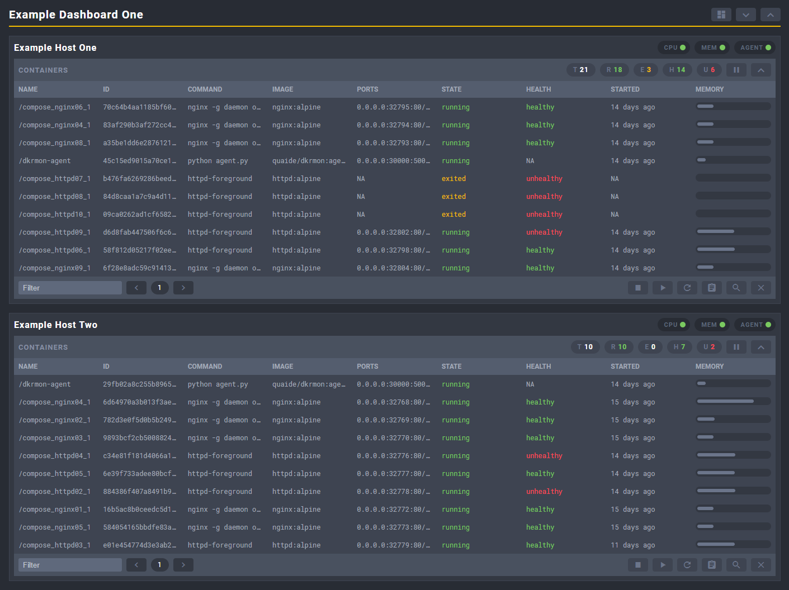

# dkrmon
dkrmon is a simple GUI for monitoring and managing Docker containers across multiple standalone hosts. dkrmon consists of server and agent elements which are designed to run as containers making deployment quick and easy.



### Installation
#### Server
Below is an example of the server Docker Compose definition:
```
version: '2.2'
services:
  dkrmon-server:
    container_name: dkrmon-server
    image: quaide/dkrmon:server
    ports:
     - "30000:5000"
    volumes:
     - /path/to/config.json:/dkrmon/app/config.json
    mem_limit: 128m
    tty: true
```

Or using Docker run:
```
docker run --name dkrmon-server -d -p 30000:5000 -m 128m -v /path/to/config.json:/dkrmon/app/config.json quaide/dkrmon:server
```
The server takes its configuration from a file called `config.json`. An example of this file is below:
```
{
  "dashboards": [
    {
      "name":"Example Dashboard","hosts": [
        {"name":"Example Server One","ip":"192.168.1.191","port":"30000"},
        {"name":"Example Server Two","ip":"192.168.1.192","port":"30000"}
      ]
    },
    {
      "name":"Dashboard Two","hosts": [
        {"name":"Example Server One","ip":"192.168.1.201","port":"30000"},
        {"name":"Example Server Two","ip":"192.168.1.202","port":"30000"}
      ]
    }
  ]
}
```
The server container reads this configuration file on start-up, so any changes to the configuration will require a container restart.
#### Agent
Below is an example of the agent Docker Compose definition:
```
version: '2.2'
services:
  dkrmon-agent:
    container_name: dkrmon-agent
    image: quaide/dkrmon:agent
    ports:
      - '30000:5000'
    volumes:
      - /var/run/docker.sock:/dkrmon/app/docker.sock:ro
      - /sys/fs/cgroup/memory/docker/:/dkrmon/stats/memory/:ro
    mem_limit: 128m
    tty: true
```
Or using docker run:
```
docker run --name dkrmon-agent -d -p 30000:5000 -v /var/run/docker.sock:/dkrmon/app/docker.sock:ro -v /sys/fs/cgroup/memory/docker/:/dkrmon/stats/memory/:ro -m 128m quaide/dkrmon:agent
```


### Usage
It is assumed that the appropriate firewall ports have been opened on the remote Docker hosts as well as the server. So in the above examples, port `30000` is open (to the server) on the agent host firewalls as well as port `30000` on the server host.

In a modern browser (Chrome, Firefox, Edge etc) browse to the server: `http://server-host:30000`

I have no plans on supporting older browsers. Life is too short.

### Issues
If the server or agent containers are not starting correctly this is almost certainly due to incorrect volume mounts or an invalid configuration file.
